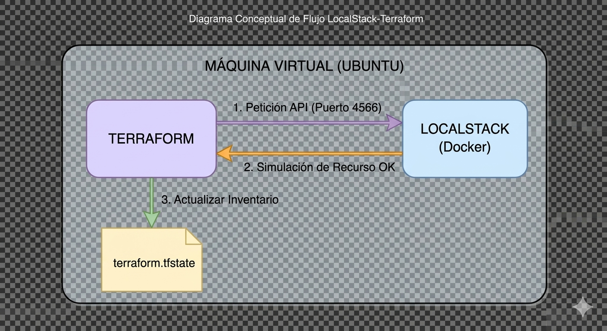
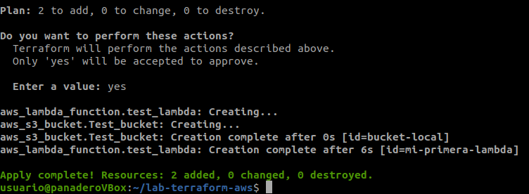
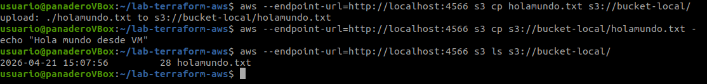
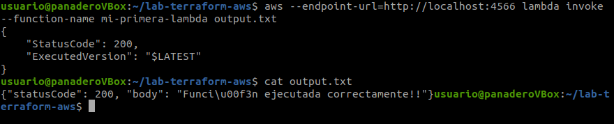
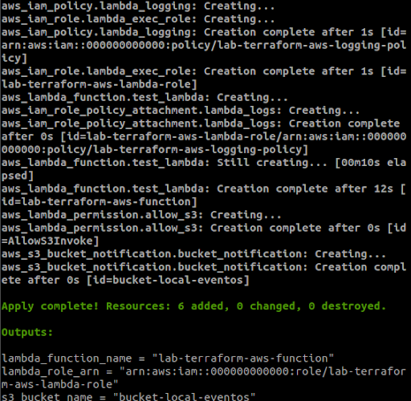
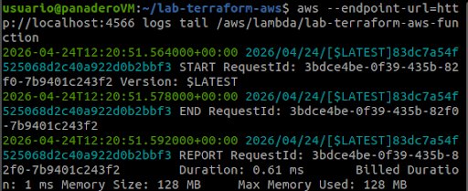

# ☁️ AWS Local Lab con Terraform + LocalStack

## 🚀 Descripción
Este proyecto simula una infraestructura AWS en entorno local utilizando **LocalStack**, **Terraform** y **Docker** sobre una máquina Ubuntu. El objetivo es practicar **Infraestructura como Código (IaC)** y conceptos de arquitectura cloud sin consumir recursos reales en AWS.

---

## 🎯 Objetivos del laboratorio
- Desplegar recursos AWS en local (S3 + Lambda).
- Automatizar infraestructura con Terraform.
- Simular arquitectura cloud en entorno aislado.
- Practicar flujos reales de trabajo DevOps.

---

## 🧠 Tecnologías utilizadas
- **Cloud**: AWS (simulado con LocalStack)
- **IaC**: Terraform
- **Contenedores**: Docker
- **Lenguaje**: Python (Lambda)
- **Sistema**: Ubuntu 20.04
- **Herramientas**: AWS CLI, Bash

---

## 🏗️ Arquitectura del laboratorio
El laboratorio incluye:
- **Bucket S3** simulado para almacenamiento.
- **Función Lambda** en Python para procesamiento.
- Infraestructura definida mediante **Terraform**.
- Ejecución sobre **LocalStack** (AWS local).

---

## 📂 Estructura del proyecto
```text
lab-terraform-aws/
├── provider.tf
├── s3.tf
├── lambda.tf
├── src/
│   └── index.py
├── holamundo.txt
├── .gitignore
└── README.md
```


---

## ⚙️ Preparación del entorno

### 1. Actualización e instalación de dependencias
```bash
sudo apt update && sudo apt upgrade -y
sudo apt install -y curl unzip gnupg software-properties-common python3-pip
```

---

### 2. 🐳 Instalación de Docker
```bash
curl -fsSL https://get.docker.com -o get-docker.sh
sudo sh get-docker.sh
sudo usermod -aG docker $USER
```

> ⚠️ Reinicia sesión para aplicar los permisos de Docker.

---

### 3. 📦 Instalación de Terraform
```bash
wget -O- https://apt.releases.hashicorp.com/gpg | sudo gpg --dearmor -o /usr/share/keyrings/hashicorp-archive-keyring.gpg

echo "deb [signed-by=/usr/share/keyrings/hashicorp-archive-keyring.gpg] https://apt.releases.hashicorp.com $(lsb_release -cs) main" | sudo tee /etc/apt/sources.list.d/hashicorp.list

sudo apt update && sudo apt install terraform
```

---

### 4. ☁️ Configuración de LocalStack
```bash
docker run -d --name localstack_main \
  -p 4566:4566 -p 4510-4559:4510-4559 \
  -e LOCALSTACK_ACKNOWLEDGE_ACCOUNT_REQUIREMENT=1 \
  -v /var/run/docker.sock:/var/run/docker.sock \
  localstack/localstack:3
```

---

## 🏗️ Despliegue con Terraform
```bash
terraform init
terraform plan
terraform apply --auto-approve
```


---

## 🧪 Pruebas de verificación

### 📦 S3
```bash
aws --endpoint-url=http://localhost:4566 s3 ls
aws --endpoint-url=http://localhost:4566 s3 cp holamundo.txt s3://bucket-local/
```



---

### ⚡ Lambda
```bash
aws --endpoint-url=http://localhost:4566 lambda invoke \
  --function-name mi-primera-lambda output.txt

cat output.txt
```



---

## 🧠 Aprendizajes clave
- Uso de LocalStack como entorno AWS local
- Automatización con Terraform
- Configuración de endpoints personalizados
- Integración básica S3 + Lambda

---
# FASE 2:
# AWS Event-Driven Architecture with Terraform & LocalStack

Este proyecto implementa una arquitectura automatizada en AWS (simulada con LocalStack) donde la subida de un archivo a un bucket S3 dispara una función Lambda para su procesamiento.

---

## 🚀 Características
- **Infraestructura como Código (IaC):** Desplegado totalmente con Terraform.
- **Seguridad IAM:** Roles y políticas con principio de menor privilegio.
- **Parametrización:** Uso de `variables.tf` para facilitar la reutilización.
- **Logs:** Monitorización en tiempo real con CloudWatch Logs.

---

## 🛠️ Tecnologías
- Terraform
- LocalStack (Simulador de AWS)
- Python 3.9 (Runtime de Lambda)
- AWS CLI


## 🧪 Comprobaciones y Verificación (Fase 2)

Para validar la arquitectura orientada a eventos, realizamos las siguientes pruebas de integración:



### 1. Despliegue de la Infraestructura
Tras verificar Terraform Init, verificamos los nuevos recursos y políticas.


### 2. Disparo del Evento (S3 -> Lambda)
Subimos un archivo al nuevo bucket parametrizado para activar el trigger, se revisan logs.
"


---

## 📈 Diagrama de Flujo
1. Usuario sube archivo a S3 (`s3api put-object`).
2. S3 detecta el evento `s3:ObjectCreated:*`.
3. S3 invoca a la Lambda gracias a los permisos definidos.
4. Lambda procesa el evento y escribe en Logs.


---

## 🔄 Fase 3: CI/CD Pipeline (DevSecOps)

En esta fase hemos implementado un flujo de **Integración Continua** utilizando **GitHub Actions**. Cada vez que se realiza un `push`, el código es auditado automáticamente.

### Flujo de Trabajo:
1. **Linter/Format:** Se verifica que el código Terraform cumpla con el estándar oficial (`terraform fmt`).
2. **Security Scan:** Se audita la infraestructura con **tfsec** para detectar brechas de seguridad (S3 sin cifrar, políticas IAM demasiado abiertas, etc.).
3. **Validation:** Se comprueba que la sintaxis de Terraform sea correcta para un despliegue limpio.

### Estado del Pipeline:


> **Nota:** Se han aplicado técnicas de *Hardening* (Cifrado AES256, Bloqueo de acceso público y Versionado) para cumplir con los estándares de seguridad detectados por el escáner.


---

## 🧹 Limpieza de recursos
```bash
terraform destroy --auto-approve
docker stop localstack_main
```

---

## 👨‍💻 Autor
José Alfonso Panadero Estudillo
Técnico de Sistemas | Cloud Computing AWS
